# The Ad That Listens

A travel ad you can interrupt. A show plays on NotFlix, a Netflix-style streaming
app. At the ad break, a live AI-generated world of the Amalfi Coast plays with a
scripted narration. Hold Space and ask it something. The narration stops, a voice
agent answers in the same voice, and the picture changes to show you.

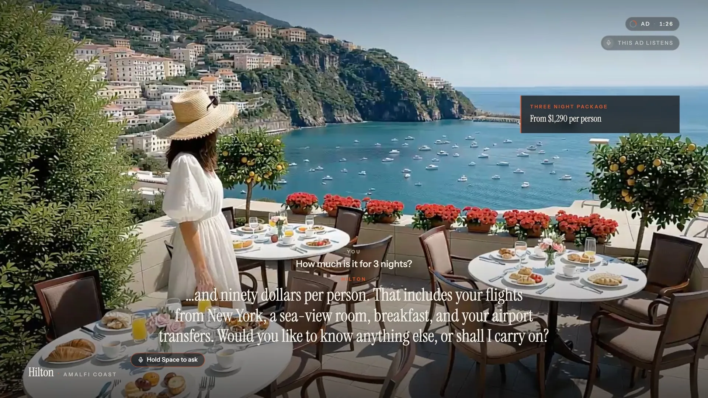

**[Watch the demo](https://jaidevshriram.com/ad-responder/)** (3½ minutes, with sound) on the project page, or download [`docs/demo.mp4`](docs/demo.mp4).

## What happens

**1. A show is playing.** NotFlix plays Big Buck Bunny (Blender Foundation, CC BY 3.0).

| Home | Watching |
|---|---|
| 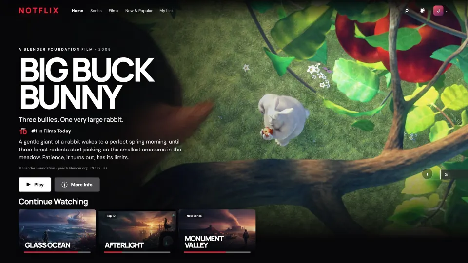 | 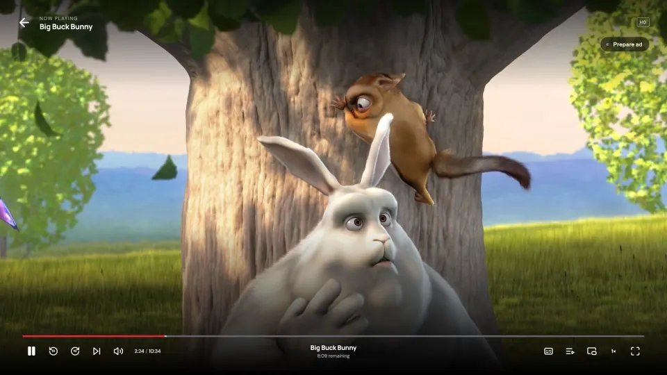 |

**2. The ad gets ready in the background.** While the show plays, the app opens a
world-model session and the voice agent. **Start the ad** lights up only when the
world is already streaming, so the break never shows a loading screen.

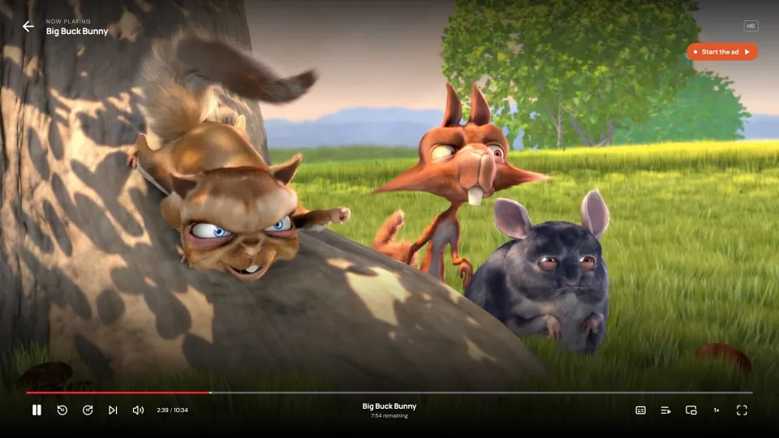

**3. The ad break.** The show eases away, a bumper says the ad listens, and the live
world fades in. Sixteen narration lines, about two minutes, each with its own shot.

| Bumper | Narration |
|---|---|
| 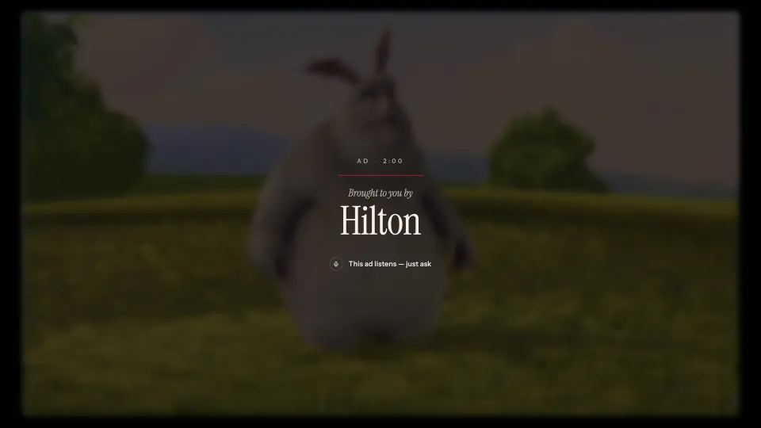 |  |

**4. You ask.** Hold Space (or the on-screen button) and speak. The narration stops,
your words appear, and the ad answers out loud, with a fact card when there is a
number to show.

| "How much is it for three nights?" | Then a sea-view room |
|---|---|
|  | 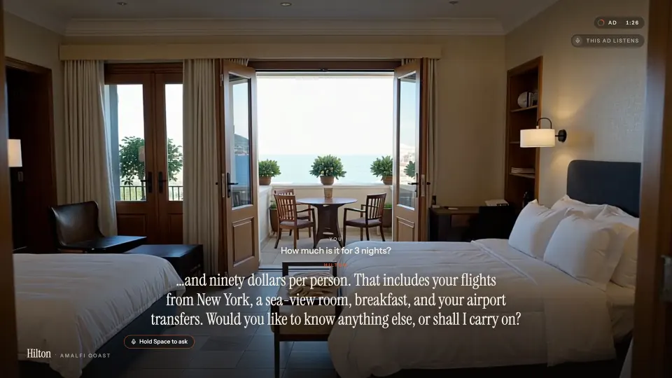 |

**5. Every answer moves the picture.** The agent sends the world model a new shot
with each answer. It lands in 4–8 seconds, while the answer is still being spoken.

| "What's it like there at night?" | Seconds later |
|---|---|
| 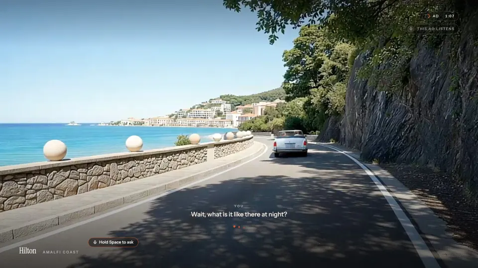 |  |

| "Do you provide transport?" | Then the coast road |
|---|---|
| 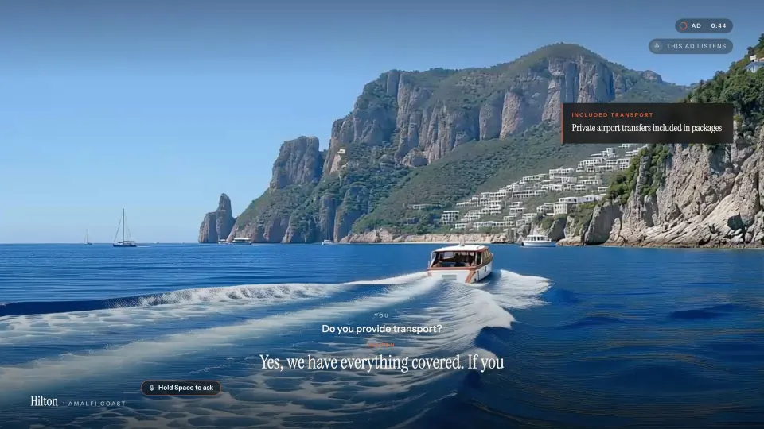 | 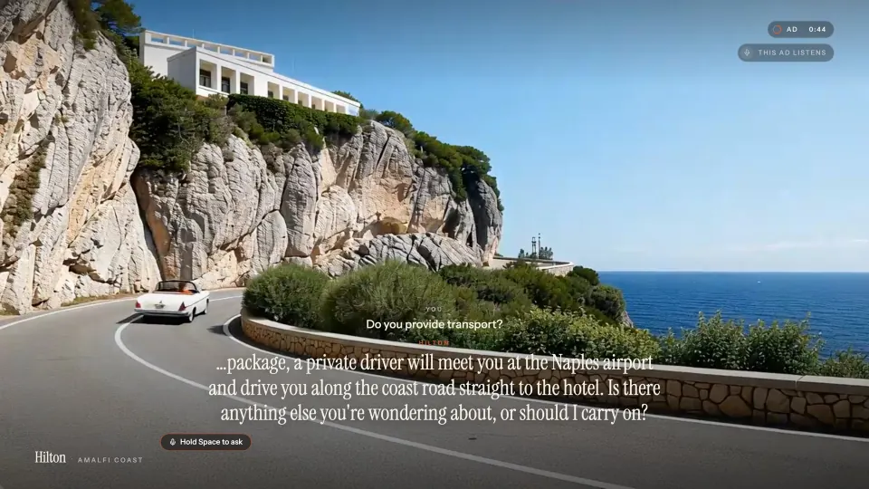 |

**6. Back to the show.** When the script ends and nobody is talking, an end card
shows, and the show resumes where it stopped.

| End card | Back to the show |
|---|---|
|  | 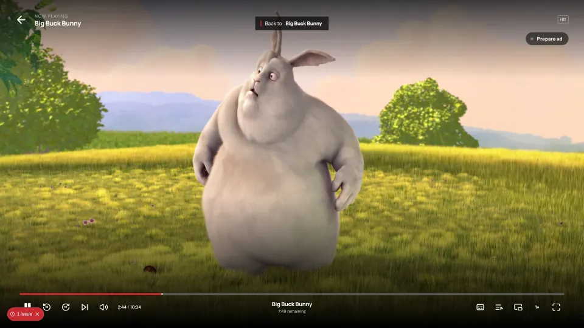 |

## How it works

```
 Mac microphone ──► voice relay (Python) ──► AssemblyAI Voice Agent
 Mac speakers   ◄──      │      ▲                 │ spoken answer + tool calls
                         │      └─────────────────┘
                         ▼ WebSocket (localhost:8765)
                    NotFlix (Next.js) ──► Reactor HappyOyster ──► live video
```

- **Voice relay** (`voice/relay.py`) owns all audio. It plays the narration, streams
  the microphone to the Voice Agent while you hold Space, plays the answers, and
  forwards the agent's tool calls to the browser.
- **AssemblyAI Voice Agent** hears the question and answers out loud. It has tools
  to look up hotel details, price a stay, check availability, change the scene,
  show a fact card and hand back to the ad.
- **Reactor HappyOyster** is a world model that streams live video. The browser
  sends it a short shot direction ("night falls over the harbour…") and the world
  moves there.
- **Push to talk.** A laptop has no echo cancelling, so an open mic would hear the
  ad and answer itself. The mic is open only while you hold Space.

The browser ⇄ relay messages are in [`docs/PROTOCOL.md`](docs/PROTOCOL.md).

## Run it on a Mac

You need macOS, Node.js 20+, Python 3.11+, and two API keys:
[AssemblyAI](https://www.assemblyai.com/) and [Reactor](https://reactor.inc/).

```bash
git clone git@github.com:jaidevshriram/ad-responder.git
cd ad-responder
npm install
npm run setup:voice                      # Python venv in .venv for the relay

cp .env.example .env.local               # add REACTOR_API_KEY
echo "ASSEMBLYAI_API_KEY=your-key" > voice/.env
```

Start the two parts in two terminals:

```bash
npm run relay        # voice relay: mic, speakers, voice agent
```

```bash
npm run dev          # NotFlix on http://localhost:3000
```

Open http://localhost:3000/notflix. The first time, macOS asks whether your
terminal may use the microphone: allow it.

1. Click **Play** on Big Buck Bunny.
2. Move the mouse and click **Prepare ad**. Wait about 20 seconds.
3. Click **Start the ad**.
4. Hold **Space**, ask a question, release. Try:
   - "How much is it for three nights?"
   - "Do you provide transport?"
   - "What's it like there at night?"
   - "What places are there nearby?"
   - "OK, carry on."

The first run builds the Amalfi world, which takes about two minutes. Its id is
saved in `data/ad-world.json` and reused after that.

| Key | What it does |
|---|---|
| Space (hold) | Talk to the ad |
| Esc | Skip the ad |
| D | Audio check panel: devices, levels, speaker and mic tests |
| A | Start the ad break now |

If the mic does not work, tap the question chips along the bottom of the ad.

| Hold to talk | Audio check (D) |
|---|---|
|  | 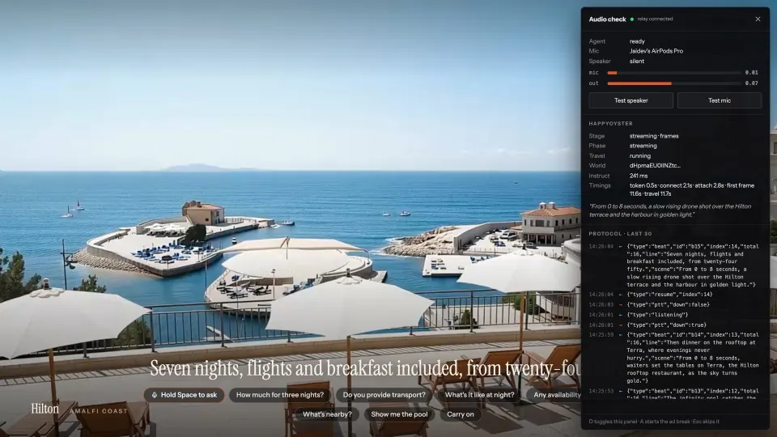 |

## Change the ad

Everything the agent knows is in [`voice/ad_script.json`](voice/ad_script.json):
the narration lines and the shot for each, the facts, the question chips and the
world prompt. The relay reads it again at the start of every ad. After changing a
narration line, record it again:

```bash
.venv/bin/python voice/make_narration.py --all
```

Prices, availability and the fallback scenes are in `voice/relay.py`.

## Files

| path | what it is |
|---|---|
| `app/notflix`, `components/` | the streaming app, the player and the ad break |
| `app/ad-lab` | developer page for the HappyOyster world |
| `app/api/happy-oyster/` | opens HappyOyster sessions server-side; stores the world id |
| `voice/relay.py` | the voice relay |
| `voice/ad_script.json` | the ad: narration, shots, facts, question chips |
| `voice/test_relay.py` | end-to-end test with synthesized questions, no sound |

## Notes

- Hilton Amalfi Coast, its prices and its facts are fictional, written for this demo.
- A reSpeaker XVF3800 mic array works too and is picked up automatically when
  plugged in. It cancels its own playback, so the mic can stay open and you can
  interrupt without holding Space.
